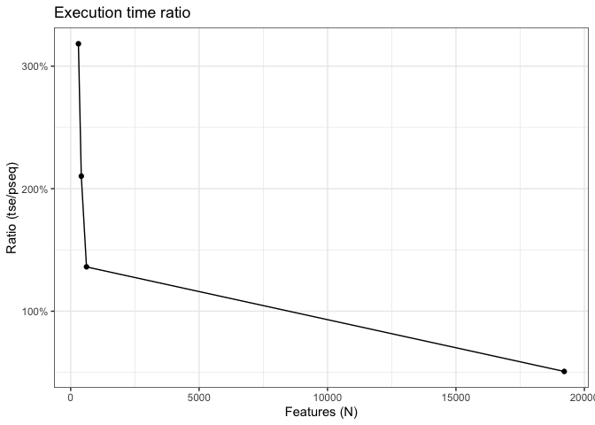

    # test melting for tse
    melt_tse_exec_time <- function(tse) {
      
        start.time1 <- Sys.time()
        molten_tse <- mia::meltAssay(tse,
                           add_row_data = TRUE,
                           add_col_data = TRUE)
        end.time1 <- Sys.time()
        
        return(end.time1 - start.time1)
      
    }

    # test melting for pseq
    melt_pseq_exec_time <- function(pseq) {
          
        start.time2 <- Sys.time()
        molten_pseq <- phyloseq::psmelt(pseq)
        end.time2 <- Sys.time()
        
        return(end.time2 - start.time2)
          
    }

    # 1) Let us first debug this fast with smaller sample sizes and only add larger data in the end when everything is clear?
    # 2) Note the changes in the data chunk -> move these changes to data.R and apply everywhere
    # 3) Question: why some entries in df$Samples have the value NA?
    # 4) Can we next have the results from multiple sample sizes in df?
    #    -> Then we can have line plots that show the same for varying sample sizes
    # 5) There is now lot of variation and no systematic trend; this may depend on data specifics;
    #    could we get a similar table of running times within each data set? For instance, by
    #    running melt for different taxonomic levels? Each taxonomic level has a different number
    #    of features; the splitByRanks function gives abundance tables for all ranks
    # 6) Include only cases where AssayValues=="counts"; complicates too
    #    much otherwise and no real added value

    # Set breaks for log X scale
    #m <- max(df$Features, na.rm=TRUE); r <- round(m, -(nchar(m)-1))
    #v <- 10^seq(2, log10(r), by=1)
    #v <- c(500, 1000, 2000, 5000, 10000)
    v <- unique(na.omit(df$Features))

    p1 <- ggplot(filter(df, Samples == 10), aes(x = Features, y = Melt, color = MeltCommand)) +
      geom_point() + 
      geom_line() +
      labs(title = paste("Melting comparison (N=", paste(unique(df$Samples), collapse=","), ")"),
           x = "Features (D)",
           y = "Execution time (s)",
           color = "Method:",
           caption = "Execution time of melting as a function of number of features") +
      scale_x_log10(breaks=v, labels=v) + # Log is often useful with sample size
      # scale_y_log10() + # Log is often useful with sample size  
      theme(legend.position = "bottom")

    print(p1)

# Compare execution time ratios

    df2 <- pivot_wider(filter(df, Samples == 10)[ , c("Dataset", "Melt", "Features", "ObjectType")] %>%
             filter(!is.na(Melt)), names_from=c(ObjectType),
                values_from=Melt, Features) %>%
             mutate(Ratio=tse/pseq)

    p2 <- ggplot(df2, aes(x=Features, y=Ratio)) +
            geom_point() +
            geom_line() +   
        scale_y_continuous(labels=scales::percent) + 
        labs(title="Execution time ratio",
             x="Features (N)",
             y="Ratio (tse/pseq)")

    print(p2)

