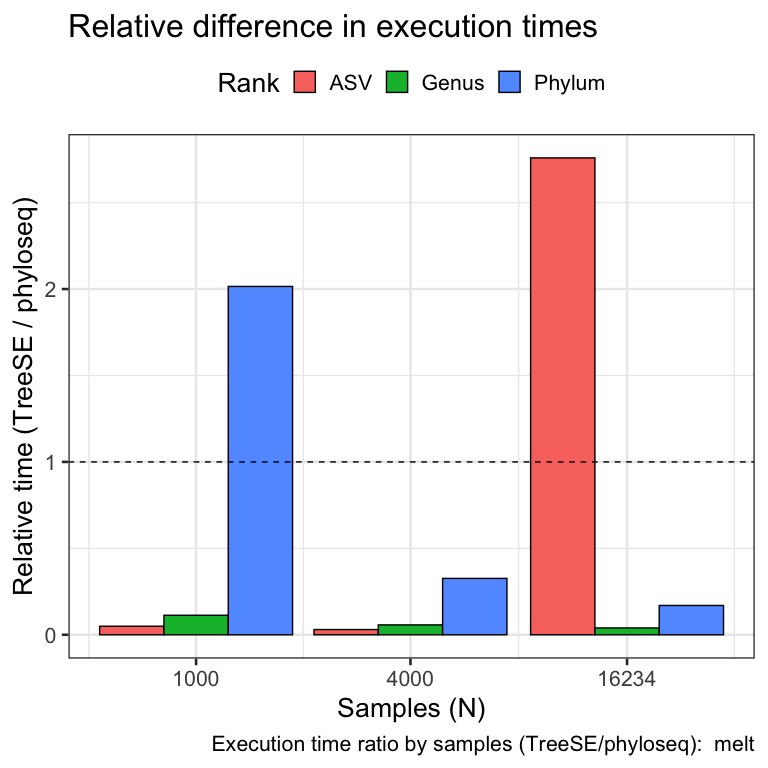
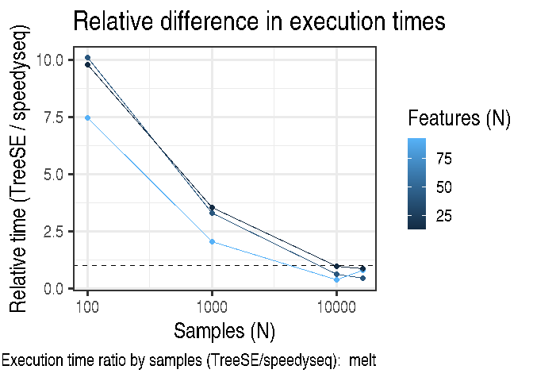

Overview
--------

This report contains the benchmarking results of the largest analysed
data set (ShaoY\_2019) for the melt operation.

Data Characteristics
--------------------

Full sample sizes by data set:

<table>
<thead>
<tr class="header">
<th style="text-align: left;">Dataset</th>
<th style="text-align: right;">Samples</th>
<th style="text-align: right;">Features</th>
</tr>
</thead>
<tbody>
<tr class="odd">
<td style="text-align: left;">ShaoY_2019</td>
<td style="text-align: right;">1644</td>
<td style="text-align: right;">830</td>
</tr>
</tbody>
</table>

Feature counts by data set:

<table>
<thead>
<tr class="header">
<th style="text-align: left;">Rank</th>
<th style="text-align: right;">ShaoY_2019</th>
</tr>
</thead>
<tbody>
<tr class="odd">
<td style="text-align: left;">Phylum</td>
<td style="text-align: right;">14</td>
</tr>
<tr class="even">
<td style="text-align: left;">Family</td>
<td style="text-align: right;">90</td>
</tr>
<tr class="odd">
<td style="text-align: left;">Species</td>
<td style="text-align: right;">819</td>
</tr>
</tbody>
</table>

Relative differences in execution time by sample size
-----------------------------------------------------

