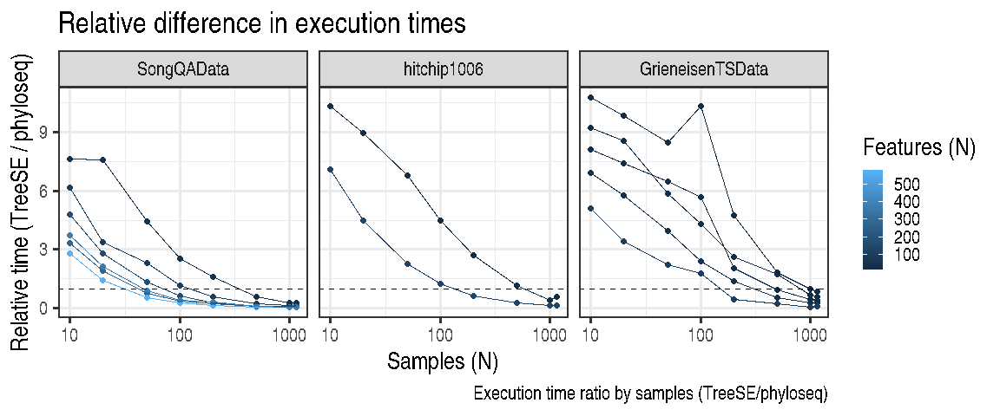
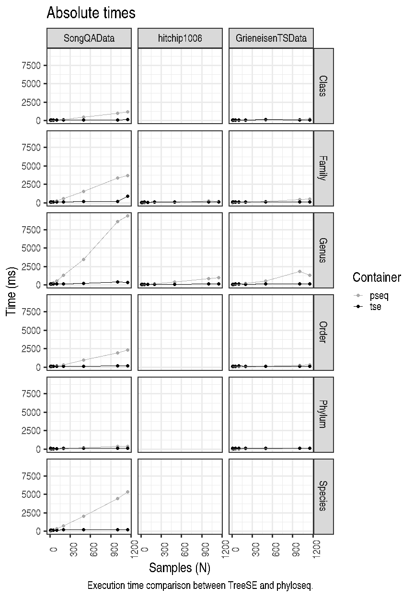
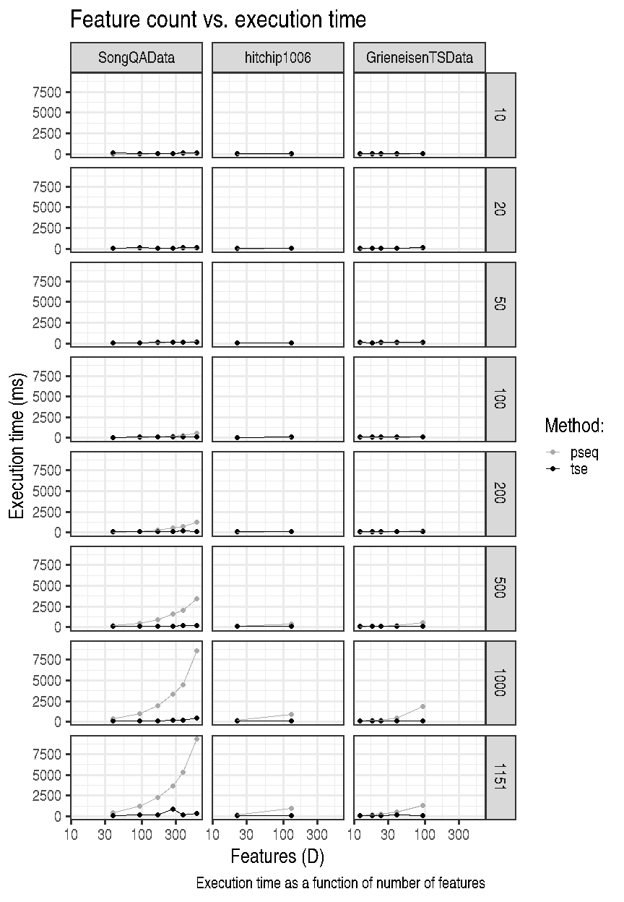

Data characteristics
--------------------

Full sample sizes by data set:

<table>
<thead>
<tr class="header">
<th style="text-align: left;">Dataset</th>
<th style="text-align: right;">N</th>
</tr>
</thead>
<tbody>
<tr class="odd">
<td style="text-align: left;">hitchip1006</td>
<td style="text-align: right;">1151</td>
</tr>
<tr class="even">
<td style="text-align: left;">SongQAData</td>
<td style="text-align: right;">1522</td>
</tr>
<tr class="odd">
<td style="text-align: left;">GrieneisenTSData</td>
<td style="text-align: right;">16234</td>
</tr>
</tbody>
</table>

Feature counts by data set:

<table>
<thead>
<tr class="header">
<th style="text-align: left;">Rank</th>
<th style="text-align: right;">SongQAData</th>
<th style="text-align: right;">hitchip1006</th>
<th style="text-align: right;">GrieneisenTSData</th>
</tr>
</thead>
<tbody>
<tr class="odd">
<td style="text-align: left;">Phylum</td>
<td style="text-align: right;">39</td>
<td style="text-align: right;">0</td>
<td style="text-align: right;">12</td>
</tr>
<tr class="even">
<td style="text-align: left;">Class</td>
<td style="text-align: right;">92</td>
<td style="text-align: right;">0</td>
<td style="text-align: right;">18</td>
</tr>
<tr class="odd">
<td style="text-align: left;">Order</td>
<td style="text-align: right;">167</td>
<td style="text-align: right;">0</td>
<td style="text-align: right;">24</td>
</tr>
<tr class="even">
<td style="text-align: left;">Family</td>
<td style="text-align: right;">271</td>
<td style="text-align: right;">22</td>
<td style="text-align: right;">40</td>
</tr>
<tr class="odd">
<td style="text-align: left;">Species</td>
<td style="text-align: right;">375</td>
<td style="text-align: right;">0</td>
<td style="text-align: right;">0</td>
</tr>
<tr class="even">
<td style="text-align: left;">Genus</td>
<td style="text-align: right;">583</td>
<td style="text-align: right;">130</td>
<td style="text-align: right;">92</td>
</tr>
</tbody>
</table>

Relative differences in execution time by sample size
-----------------------------------------------------

Absolute execution time by sample size
--------------------------------------

Execution times vs number of features
-------------------------------------

