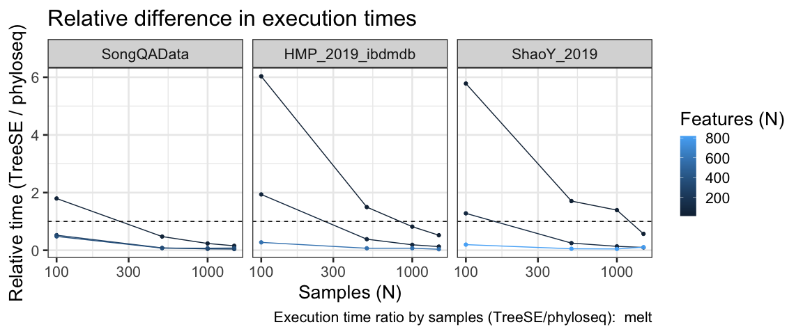
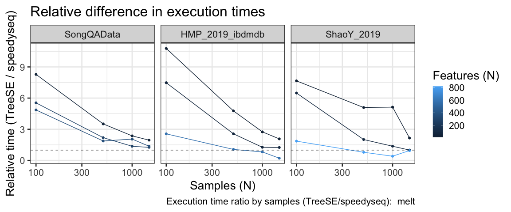
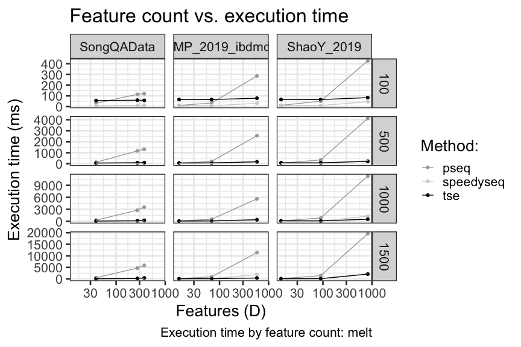

## Overview

This report contains benchmarking results for the melt operation with
common microbiome data containers in R/Bioconductor for the melt
operation.

The tests utilize the following publicly available data sets. We thank
the original authors for making these valuable data resources openly
available. Check the links for details and original references:

-   [AsnicarF\_2021](https://pubmed.ncbi.nlm.nih.gov/33432175/)
-   [LifeLinesDeep\_2016](https://pubmed.ncbi.nlm.nih.gov/27126040/)
-   [SongQAData](https://microbiome.github.io/microbiomeDataSets/reference/SongQAData.html)
    Song et al. (2016)
-   HMP\_2019\_ibdmdb (([source
    1](https://pubmed.ncbi.nlm.nih.gov/29311644/), [source
    2](https://pubmed.ncbi.nlm.nih.gov/31142855/))
-   [ShaoY\_2019](https://pubmed.ncbi.nlm.nih.gov/31534227/)
-   [GrieneisenTSData](https://microbiome.github.io/microbiomeDataSets/reference/GrieneisenTSData.html)
    Grieneisen et al. (2021) baboon data set

## Data characteristics

Full sample sizes by data set:

<table>
<thead>
<tr class="header">
<th style="text-align: left;">Dataset</th>
<th style="text-align: right;">N</th>
</tr>
</thead>
<tbody>
<tr class="odd">
<td style="text-align: left;">AsnicarF_2017</td>
<td style="text-align: right;">24</td>
</tr>
<tr class="even">
<td style="text-align: left;">GlobalPatterns</td>
<td style="text-align: right;">26</td>
</tr>
<tr class="odd">
<td style="text-align: left;">GrieneisenTSData</td>
<td style="text-align: right;">16234</td>
</tr>
</tbody>
</table>

Feature counts by data set:

<table>
<thead>
<tr class="header">
<th style="text-align: left;">Rank</th>
<th style="text-align: right;">AsnicarF_2017</th>
<th style="text-align: right;">GlobalPatterns</th>
<th style="text-align: right;">GrieneisenTSData</th>
</tr>
</thead>
<tbody>
<tr class="odd">
<td style="text-align: left;">Phylum</td>
<td style="text-align: right;">10</td>
<td style="text-align: right;">66</td>
<td style="text-align: right;">12</td>
</tr>
<tr class="even">
<td style="text-align: left;">Class</td>
<td style="text-align: right;">21</td>
<td style="text-align: right;">139</td>
<td style="text-align: right;">18</td>
</tr>
<tr class="odd">
<td style="text-align: left;">Order</td>
<td style="text-align: right;">33</td>
<td style="text-align: right;">204</td>
<td style="text-align: right;">24</td>
</tr>
<tr class="even">
<td style="text-align: left;">Family</td>
<td style="text-align: right;">56</td>
<td style="text-align: right;">341</td>
<td style="text-align: right;">40</td>
</tr>
<tr class="odd">
<td style="text-align: left;">Genus</td>
<td style="text-align: right;">118</td>
<td style="text-align: right;">996</td>
<td style="text-align: right;">92</td>
</tr>
<tr class="even">
<td style="text-align: left;">Species</td>
<td style="text-align: right;">301</td>
<td style="text-align: right;">944</td>
<td style="text-align: right;">0</td>
</tr>
</tbody>
</table>

## Relative differences in execution time by sample size

## Absolute execution time by sample size

## Execution times vs number of features

