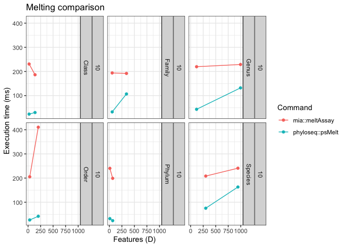

# Melting Experiment

## Plot of execution times vs number of features with fixed number of samples

## Plot of tse-to-pseq ratio of vs number of features

## Plot of execution times vs number of features for multiple combinations of taxonomic ranks and sample sizes

