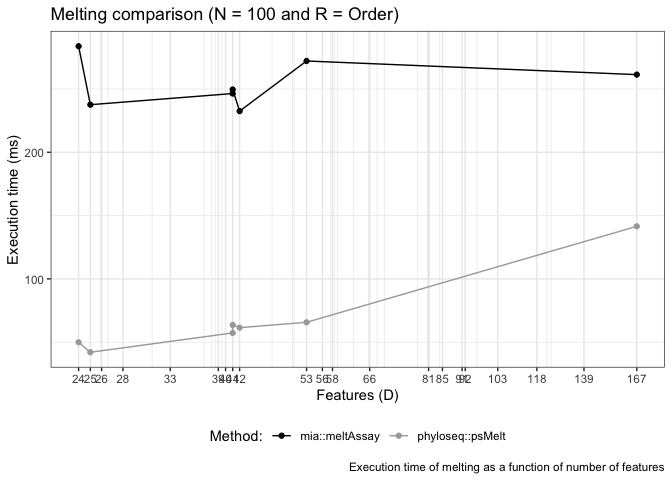
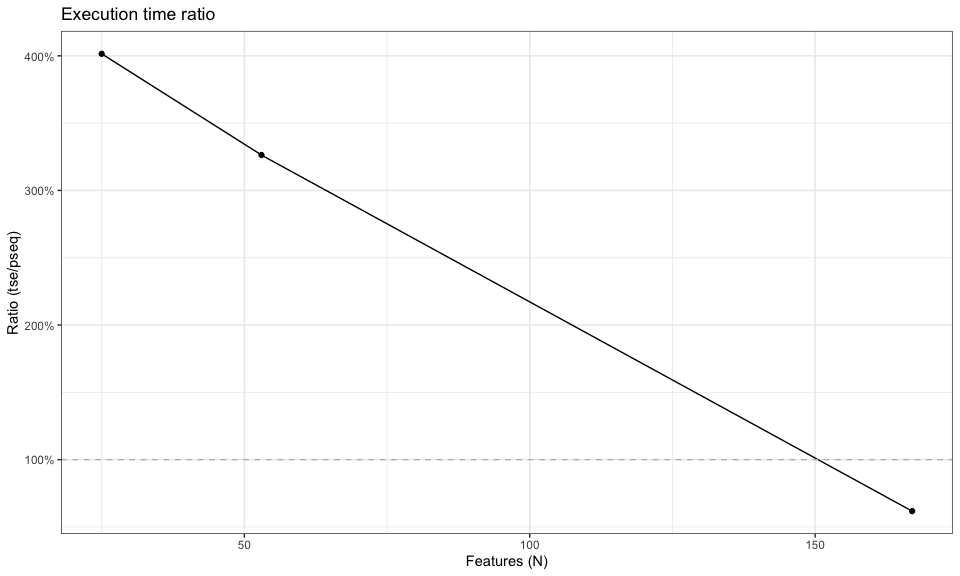

    ### FUNCTION TO TEST MELTING FOR TSE OBJECT ###
    melt_tse_exec_time <- function(tse) {
      
      start.time1 <- Sys.time()
      molten_tse <- mia::meltAssay(tse,
                                   add_row_data = TRUE,
                                   add_col_data = TRUE)
      end.time1 <- Sys.time()
      
      return(end.time1 - start.time1)
      
    }

    ### FUNCTION TO TEST MELTING FOR TSE OBJECT ###
    melt_pseq_exec_time <- function(pseq) {
      
      start.time2 <- Sys.time()
      molten_pseq <- phyloseq::psmelt(pseq)
      end.time2 <- Sys.time()
      
      return(end.time2 - start.time2)
      
    }

    # run benchmark on melting of tse and pseq with custom sample sizes
    df_melt <- experiment_benchmark(containers, df, melt_tse_exec_time, melt_pseq_exec_time, sample_sizes)

    # merge results from each data set into one data frame
    df_melt <- df_melt %>% merge_all() %>% filter(!is.na(Time))

    # define sample size N and rank R for the plots
    N <- 10
    R <- "Order"

    # plot execution time for melting subsets from
    # the taxonomic rank "Order" and with 1000 samples 
    p1_melt <- plot_exec_time(df_melt, N, R)
    print(p1_melt)

    # make data frame with Time Ratio of tse to pseq execution time of experiment
    dfsub <- pivot_wider(filter(df_melt, Samples == N, Rank == R)[ , c("Dataset", "Time", "Features", "ObjectType")], 
                         names_from = c(ObjectType),
                         values_from = Time, Features) %>%
      mutate(Ratio = tse / pseq)

    # plot execution time ratio for melting subsets from
    # the taxonomic rank "Order" and with 1000 samples
    p2_melt <- plot_ratio(dfsub)
    print(p2_melt)

