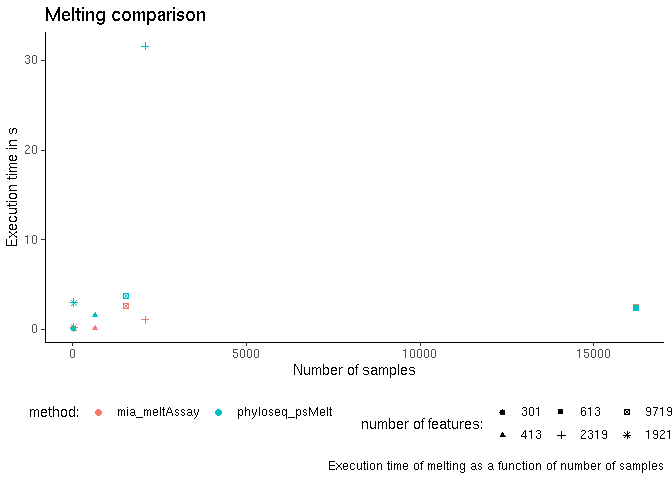
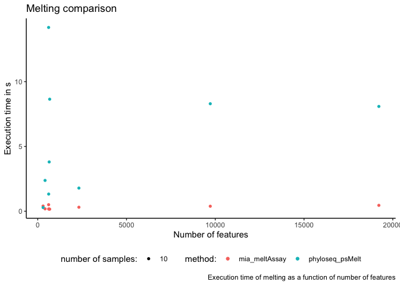
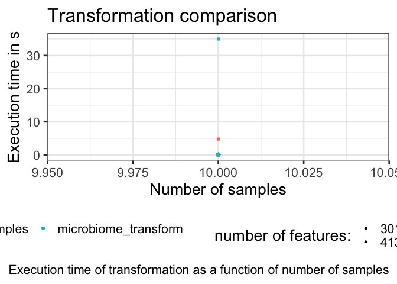
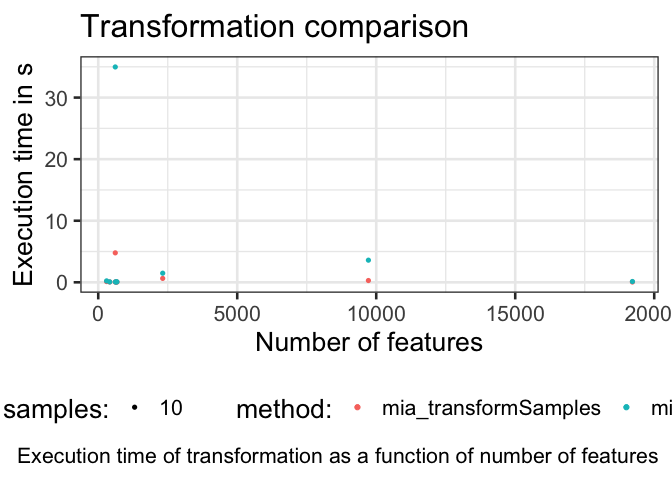
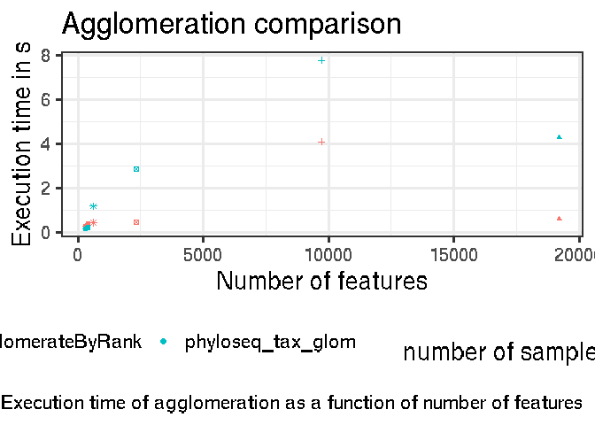
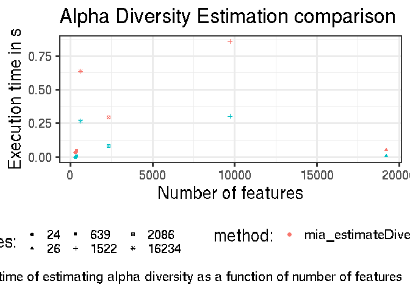
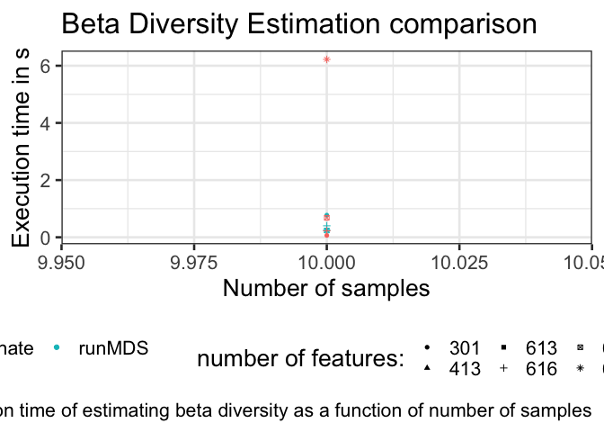
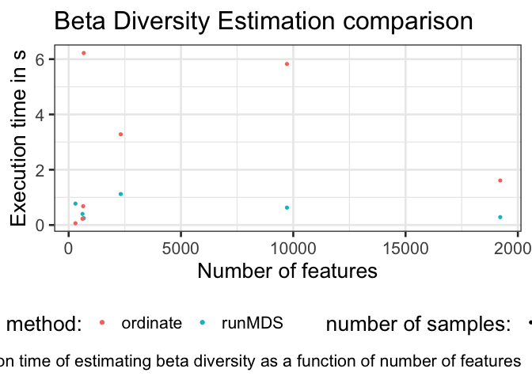

# Computational efficiency of TreeSE methods

This document provides some benchmarking results comparing the
computational efficiency in standard operations between
`TreeSummarizedExperiment` (tse) and `phyloseq` (pseq) containers for
microbiome data.

## Introduction

To estimate the time efficiency of homologous tasks but with different
data structures (`tse` or `pseq`), we have benchmarked a set of standard
data manipulation routines on data sets of varying numbers of samples
and features, as reported below.

## Data sets

The comparisons are based on publicly available data sets from the
curatedMetagenomicData project. See the homepage for the details and
references.

    # Working variables are assigned with a placeholder to work with them inside the next for loop.
    data_sets <- c("AsnicarF_2017", "GlobalPatterns", "VincentC_2016", "BackhedF_2015", "SilvermanAGutData", "ZeeviD_2015", "SongQAData", "SprockettTHData", "GrieneisenTSData")

    set.seed(3)
    sample_size <- 10

    len_set <- length(data_sets)
    tse <- TreeSummarizedExperiment()
    tmp <- list()

Execution times for different experiments, data sets and containers are
evaluated with a recursive approach. Results are stored into `df`.

# Compare execution times

### Melting

Melting versus samples.

    ggplot(df, aes(x = Samples, y = Melt, color = MeltCommand, shape = as.factor(Features))) +
      geom_point() +
      labs(title = "Melting comparison", x = "Number of samples", y = "Execution time in s", color = "method:", shape = "number of features:", caption = "Execution time of melting as a function of number of samples") +
      theme_classic() +
      theme(legend.position = "bottom")

Melting versus features.

    ggplot(df, aes(x = Features, y = Melt, color = MeltCommand, shape = as.factor(Samples))) +
      geom_point() +
      labs(title = "Melting comparison",
           x = "Number of features",
           y = "Execution time in s",
           color = "method:", shape = "number of samples:",
           caption = "Execution time of melting as a function of number of features") +
      theme_classic() +
      theme(legend.position = "bottom")

### Transformations

    ggplot(df, aes(x = Samples, y = Transform, color = TransformCommand, shape = as.factor(Features))) +
      geom_point() +
      labs(title = "Transformation comparison",
           x = "Number of samples",
           y = "Execution time in s",
           color = "method:",
           shape = "number of features:",
           caption = "Execution time of transformation as a function of number of samples") +
      theme(legend.position = "bottom")

    ggplot(df, aes(x = Features, y = Transform, color = TransformCommand, shape = as.factor(Samples))) +
      geom_point() +
      labs(title = "Transformation comparison",
           x = "Number of features",
           y = "Execution time in s",
           color = "method:", shape = "number of samples:",
           caption = "Execution time of transformation as a function of number of features") +
      theme(legend.position = "bottom")

### Agglomeration

Agglomeration versus samples

    ggplot(df, aes(x = Samples, y = Agglomerate, color = AgglomerateCommand, shape = as.factor(Features))) +
      geom_point() +
      labs(title = "Agglomeration comparison",
           x = "Number of samples",
           y = "Execution time in s",
           color = "method:",
           shape = "number of features:",
           caption = "Execution time of agglomeration as a function of number of samples") +
      theme(legend.position = "bottom")

Agglomeration versus features

    ggplot(df, aes(x = Features, y = Agglomerate, color = AgglomerateCommand, shape = as.factor(Samples))) +
      geom_point() +
      labs(title = "Agglomeration comparison",
           x = "Number of features",
           y = "Execution time in s",
           color = "method:",
           shape = "number of samples:",
           caption = "Execution time of agglomeration as a function of number of features") +
      theme(legend.position = "bottom")

### Alpha diversity

Beta diversity versus sample size.

    ggplot(df, aes(x = Samples, y = AlphaEstimation, color = AlphaCommand, shape = as.factor(Features))) +
      geom_point() +
      labs(title = "Alpha Diversity Estimation comparison",
           x = "Number of samples",
           y = "Execution time in s",
           color = "method:",
           shape = "number of features:",
           caption = "Execution time of estimating alpha diversity as a function of number of samples") +
      theme(legend.position = "bottom")

Beta diversity versus feature size.

    ggplot(df, aes(x = Features, y = AlphaEstimation, color = AlphaCommand, shape = as.factor(Samples))) +
      geom_point() +
      labs(title = "Alpha Diversity Estimation comparison",
           x = "Number of features",
           y = "Execution time in s",
           color = "method:",
           shape = "number of samples:",
           caption = "Execution time of estimating alpha diversity as a function of number of features") +
      theme(legend.position = "bottom")

### Beta diversity

Beta diversity versus sample size.

    ggplot(df, aes(x = Samples, y = BetaEstimation, color = BetaCommand, shape = as.factor(Features))) +
      geom_point() +
      labs(title = "Beta Diversity Estimation comparison",
           x = "Number of samples",
           y = "Execution time in s",
           color = "method:",
           shape = "number of features:",
           caption = "Execution time of estimating beta diversity as a function of number of samples") +
      theme(legend.position = "bottom")

Beta diversity versus feature size.

    ggplot(df, aes(x = Features, y = BetaEstimation, color = BetaCommand, shape = as.factor(Samples))) +
      geom_point() +
      labs(title = "Beta Diversity Estimation comparison",
           x = "Number of features",
           y = "Execution time in s",
           color = "method:",
           shape = "number of samples:",
           caption = "Execution time of estimating beta diversity as a function of number of features") +
      theme(legend.position = "bottom")

# Mean difference in execution time

    mean_time <- df %>% group_by(ObjectType) %>%
                        summarize(mean_melt = mean(Melt),
                          mean_transform = mean(Transform),
                      mean_agglomerate = mean(Agglomerate),
                      mean_alpha = mean(AlphaEstimation),
                      mean_beta = mean(BetaEstimation, na.rm = TRUE))
    mean_time

    ## # A tibble: 2 × 6
    ##   ObjectType mean_melt mean_transform mean_agglomerate mean_alpha mean_beta
    ##   <chr>          <dbl>          <dbl>            <dbl>      <dbl>     <dbl>
    ## 1 pseq           5.42           4.52              6.87      0.985     2.56 
    ## 2 tse            0.301          0.675             4.54      0.638     0.527
