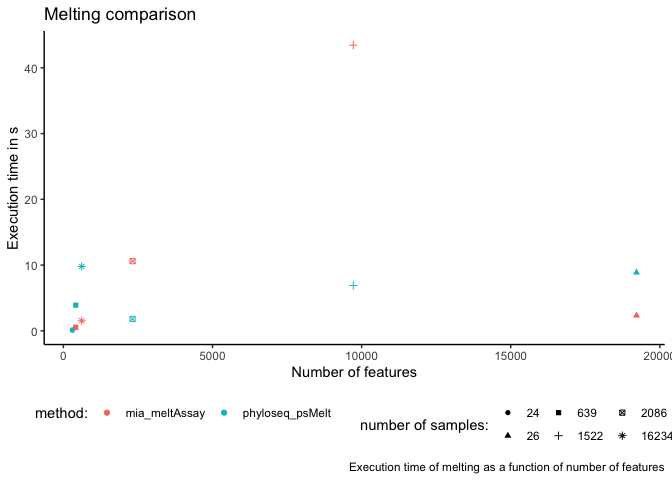
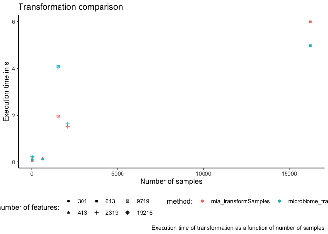
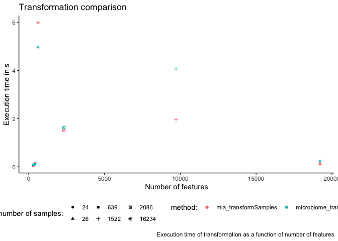
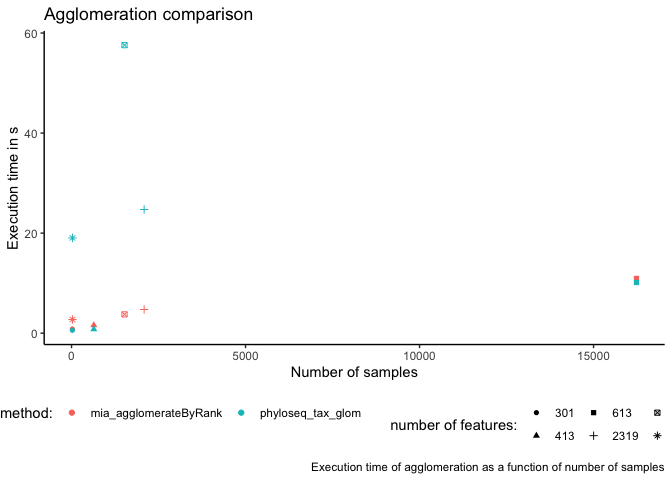
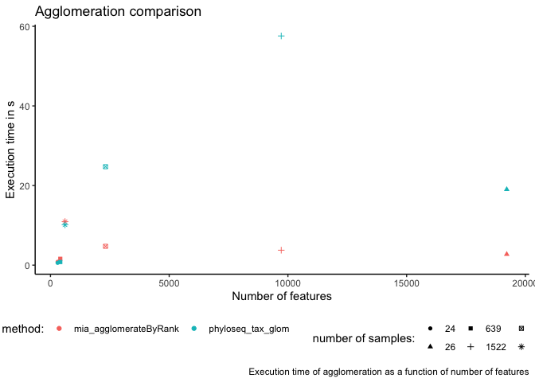
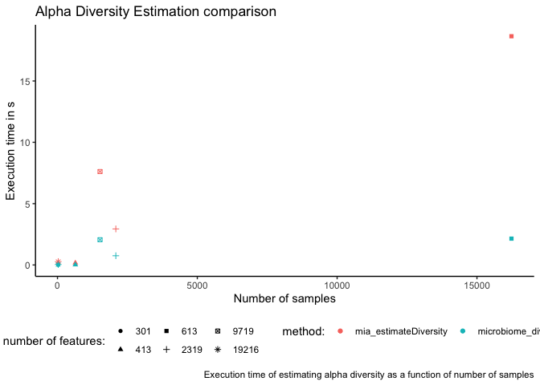
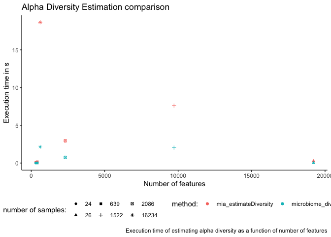
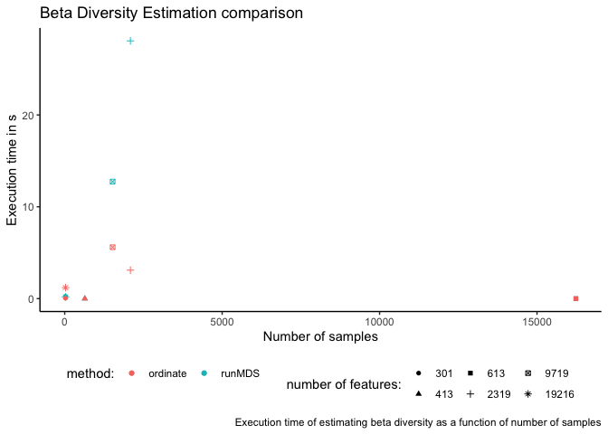
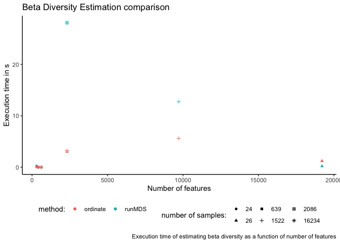

# Speed comparisons between `tse` and `pseq`containers

## Introduction

To estimate the time efficiency of homologous tasks but with different
targets (`tse` or `pseq`), the following working routines are performed
on data sets of various size and compared in terms of the targeted
object class:

-   Melting
-   Transformation
-   Agglomeration
-   Alpha diversity estimation
-   Beta diversity estimation

The analyzed data sets include:

-   AsnicarF\_2017.relative\_abundance
-   GlobalPatterns
-   VincentC\_2016
-   SilvermanAGutData
-   SongQAData
-   SprockettTHData
-   GrieneisenTSData

## Experiments

First, the needed packages are loaded and the names of the sample data
sets are listed in `data_sets`. This script can potentially be adjusted
to a larger number of data sets.

    # call packages to load data sets
    library(dplyr)

    ##
    ## Присоединяю пакет: 'dplyr'

    ## Следующие объекты скрыты от 'package:stats':
    ##
    ##     filter, lag

    ## Следующие объекты скрыты от 'package:base':
    ##
    ##     intersect, setdiff, setequal, union

    library(mia)

    ## Загрузка требуемого пакета: SummarizedExperiment

    ## Загрузка требуемого пакета: MatrixGenerics

    ## Загрузка требуемого пакета: matrixStats

    ##
    ## Присоединяю пакет: 'matrixStats'

    ## Следующий объект скрыт от 'package:dplyr':
    ##
    ##     count

    ##
    ## Присоединяю пакет: 'MatrixGenerics'

    ## Следующие объекты скрыты от 'package:matrixStats':
    ##
    ##     colAlls, colAnyNAs, colAnys, colAvgsPerRowSet, colCollapse,
    ##     colCounts, colCummaxs, colCummins, colCumprods, colCumsums,
    ##     colDiffs, colIQRDiffs, colIQRs, colLogSumExps, colMadDiffs,
    ##     colMads, colMaxs, colMeans2, colMedians, colMins, colOrderStats,
    ##     colProds, colQuantiles, colRanges, colRanks, colSdDiffs, colSds,
    ##     colSums2, colTabulates, colVarDiffs, colVars, colWeightedMads,
    ##     colWeightedMeans, colWeightedMedians, colWeightedSds,
    ##     colWeightedVars, rowAlls, rowAnyNAs, rowAnys, rowAvgsPerColSet,
    ##     rowCollapse, rowCounts, rowCummaxs, rowCummins, rowCumprods,
    ##     rowCumsums, rowDiffs, rowIQRDiffs, rowIQRs, rowLogSumExps,
    ##     rowMadDiffs, rowMads, rowMaxs, rowMeans2, rowMedians, rowMins,
    ##     rowOrderStats, rowProds, rowQuantiles, rowRanges, rowRanks,
    ##     rowSdDiffs, rowSds, rowSums2, rowTabulates, rowVarDiffs, rowVars,
    ##     rowWeightedMads, rowWeightedMeans, rowWeightedMedians,
    ##     rowWeightedSds, rowWeightedVars

    ## Загрузка требуемого пакета: GenomicRanges

    ## Загрузка требуемого пакета: stats4

    ## Загрузка требуемого пакета: BiocGenerics

    ##
    ## Присоединяю пакет: 'BiocGenerics'

    ## Следующие объекты скрыты от 'package:dplyr':
    ##
    ##     combine, intersect, setdiff, union

    ## Следующие объекты скрыты от 'package:stats':
    ##
    ##     IQR, mad, sd, var, xtabs

    ## Следующие объекты скрыты от 'package:base':
    ##
    ##     Filter, Find, Map, Position, Reduce, anyDuplicated, append,
    ##     as.data.frame, basename, cbind, colnames, dirname, do.call,
    ##     duplicated, eval, evalq, get, grep, grepl, intersect, is.unsorted,
    ##     lapply, mapply, match, mget, order, paste, pmax, pmax.int, pmin,
    ##     pmin.int, rank, rbind, rownames, sapply, setdiff, sort, table,
    ##     tapply, union, unique, unsplit, which.max, which.min

    ## Загрузка требуемого пакета: S4Vectors

    ##
    ## Присоединяю пакет: 'S4Vectors'

    ## Следующие объекты скрыты от 'package:dplyr':
    ##
    ##     first, rename

    ## Следующие объекты скрыты от 'package:base':
    ##
    ##     I, expand.grid, unname

    ## Загрузка требуемого пакета: IRanges

    ##
    ## Присоединяю пакет: 'IRanges'

    ## Следующие объекты скрыты от 'package:dplyr':
    ##
    ##     collapse, desc, slice

    ## Загрузка требуемого пакета: GenomeInfoDb

    ## Загрузка требуемого пакета: Biobase

    ## Welcome to Bioconductor
    ##
    ##     Vignettes contain introductory material; view with
    ##     'browseVignettes()'. To cite Bioconductor, see
    ##     'citation("Biobase")', and for packages 'citation("pkgname")'.

    ##
    ## Присоединяю пакет: 'Biobase'

    ## Следующий объект скрыт от 'package:MatrixGenerics':
    ##
    ##     rowMedians

    ## Следующие объекты скрыты от 'package:matrixStats':
    ##
    ##     anyMissing, rowMedians

    ## Загрузка требуемого пакета: SingleCellExperiment

    ## Загрузка требуемого пакета: TreeSummarizedExperiment

    ## Загрузка требуемого пакета: Biostrings

    ## Загрузка требуемого пакета: XVector

    ##
    ## Присоединяю пакет: 'Biostrings'

    ## Следующий объект скрыт от 'package:base':
    ##
    ##     strsplit

    library(microbiomeDataSets)

    ## Загрузка требуемого пакета: MultiAssayExperiment

    library(curatedMetagenomicData)
    library(ggplot2)
    library(scater)

    ## Загрузка требуемого пакета: scuttle

    # list names of data sets
    data_sets <- c("AsnicarF_2017.relative_abundance", "GlobalPatterns", "SilvermanAGutData", "SongQAData", "SprockettTHData", "GrieneisenTSData")
    len_set <- length(data_sets)
    tse <- TreeSummarizedExperiment()
    tmp <- list()

Working variables are assigned with a placeholder to work with them
inside the next for loop.

    object_types <- c(rep("tse", len_set), rep("pseq", len_set))

    melt_command <- c(rep("mia_meltAssay", len_set), rep("phyloseq_psMelt", len_set))

    transform_command <- c(rep("mia_transformSamples", len_set), rep("microbiome_transform", len_set))

    agglomerate_command <- c(rep("mia_agglomerateByRank", len_set), rep("phyloseq_tax_glom", len_set))

    alpha_command <- c(rep("mia_estimateDiversity", len_set), rep("microbiome_diversity", len_set))

    beta_command <- c(rep("runMDS", len_set), rep("ordinate", len_set))

    assay_values <- rep(c("relative_abundance", "counts", "counts", "counts", "counts", "counts"), 2)

    df <- data.frame(Features = rep(0, len_set), Samples = rep(0, len_set), Melt = rep(0, len_set), Transform = rep(0, len_set), Agglomerate = rep(0, len_set), AlphaEstimation = rep(0, len_set), BetaEstimation = rep(0, len_set), row.names = data_sets)

    df <- rbind(df[rep(1:len_set, 2), ]) %>% mutate(ObjectType = object_types, MeltCommand = melt_command, TransformCommand = transform_command, AgglomerateCommand = agglomerate_command, AlphaCommand = alpha_command, BetaCommand = beta_command, AssayValues = assay_values)

    rm("object_types", "melt_command", "transform_command", "agglomerate_command", "alpha_command", "beta_command", "assay_values")

    df

    ##                                    Features Samples Melt Transform Agglomerate
    ## AsnicarF_2017.relative_abundance          0       0    0         0           0
    ## GlobalPatterns                            0       0    0         0           0
    ## SilvermanAGutData                         0       0    0         0           0
    ## SongQAData                                0       0    0         0           0
    ## SprockettTHData                           0       0    0         0           0
    ## GrieneisenTSData                          0       0    0         0           0
    ## AsnicarF_2017.relative_abundance.1        0       0    0         0           0
    ## GlobalPatterns.1                          0       0    0         0           0
    ## SilvermanAGutData.1                       0       0    0         0           0
    ## SongQAData.1                              0       0    0         0           0
    ## SprockettTHData.1                         0       0    0         0           0
    ## GrieneisenTSData.1                        0       0    0         0           0
    ##                                    AlphaEstimation BetaEstimation ObjectType
    ## AsnicarF_2017.relative_abundance                 0              0        tse
    ## GlobalPatterns                                   0              0        tse
    ## SilvermanAGutData                                0              0        tse
    ## SongQAData                                       0              0        tse
    ## SprockettTHData                                  0              0        tse
    ## GrieneisenTSData                                 0              0        tse
    ## AsnicarF_2017.relative_abundance.1               0              0       pseq
    ## GlobalPatterns.1                                 0              0       pseq
    ## SilvermanAGutData.1                              0              0       pseq
    ## SongQAData.1                                     0              0       pseq
    ## SprockettTHData.1                                0              0       pseq
    ## GrieneisenTSData.1                               0              0       pseq
    ##                                        MeltCommand     TransformCommand
    ## AsnicarF_2017.relative_abundance     mia_meltAssay mia_transformSamples
    ## GlobalPatterns                       mia_meltAssay mia_transformSamples
    ## SilvermanAGutData                    mia_meltAssay mia_transformSamples
    ## SongQAData                           mia_meltAssay mia_transformSamples
    ## SprockettTHData                      mia_meltAssay mia_transformSamples
    ## GrieneisenTSData                     mia_meltAssay mia_transformSamples
    ## AsnicarF_2017.relative_abundance.1 phyloseq_psMelt microbiome_transform
    ## GlobalPatterns.1                   phyloseq_psMelt microbiome_transform
    ## SilvermanAGutData.1                phyloseq_psMelt microbiome_transform
    ## SongQAData.1                       phyloseq_psMelt microbiome_transform
    ## SprockettTHData.1                  phyloseq_psMelt microbiome_transform
    ## GrieneisenTSData.1                 phyloseq_psMelt microbiome_transform
    ##                                       AgglomerateCommand          AlphaCommand
    ## AsnicarF_2017.relative_abundance   mia_agglomerateByRank mia_estimateDiversity
    ## GlobalPatterns                     mia_agglomerateByRank mia_estimateDiversity
    ## SilvermanAGutData                  mia_agglomerateByRank mia_estimateDiversity
    ## SongQAData                         mia_agglomerateByRank mia_estimateDiversity
    ## SprockettTHData                    mia_agglomerateByRank mia_estimateDiversity
    ## GrieneisenTSData                   mia_agglomerateByRank mia_estimateDiversity
    ## AsnicarF_2017.relative_abundance.1     phyloseq_tax_glom  microbiome_diversity
    ## GlobalPatterns.1                       phyloseq_tax_glom  microbiome_diversity
    ## SilvermanAGutData.1                    phyloseq_tax_glom  microbiome_diversity
    ## SongQAData.1                           phyloseq_tax_glom  microbiome_diversity
    ## SprockettTHData.1                      phyloseq_tax_glom  microbiome_diversity
    ## GrieneisenTSData.1                     phyloseq_tax_glom  microbiome_diversity
    ##                                    BetaCommand        AssayValues
    ## AsnicarF_2017.relative_abundance        runMDS relative_abundance
    ## GlobalPatterns                          runMDS             counts
    ## SilvermanAGutData                       runMDS             counts
    ## SongQAData                              runMDS             counts
    ## SprockettTHData                         runMDS             counts
    ## GrieneisenTSData                        runMDS             counts
    ## AsnicarF_2017.relative_abundance.1    ordinate relative_abundance
    ## GlobalPatterns.1                      ordinate             counts
    ## SilvermanAGutData.1                   ordinate             counts
    ## SongQAData.1                          ordinate             counts
    ## SprockettTHData.1                     ordinate             counts
    ## GrieneisenTSData.1                    ordinate             counts

Execution times for different experiments, data sets and containers are
evaluated with a recursive approach. Results are then stored into the
matrices `diff_tse` and `diff_pseq`, which contains the execution times
of tse-based and pseq-based experiments, respectively.

    condition_1 <- data_sets == "GlobalPatterns"
    condition_2 <- data_sets %in% c("SilvermanAGutData", "SongQAData", "SprockettTHData", "GrieneisenTSData")
    condition_3 <- data_sets == "GrieneisenTSData"
    condition_4 <- data_sets %in% c("AsnicarF_2017.relative_abundance", "VincentC_2016")
    condition_5 <- data_sets == "AsnicarF_2017.relative_abundance"
    condition_6 <- !(data_sets %in% c("SilvermanAGutData", "GrieneisenTSData"))

    # compare execution times
    for (data_set in data_sets) {

      cur_set <- which(data_sets == data_set)

      if (condition_1[cur_set]) {

        mapply(data, list = data_set, package = "mia")
        tse <- eval(parse(text = data_set))
        mapply(data, list = data_set, package = "phyloseq")
        pseq <- eval(parse(text = data_set))

      } else if (condition_2[cur_set]) {

        tse <- eval((parse(text = paste0(data_set, "()"))))

        if (condition_3[cur_set]) {
          rowData(tse) <- DataFrame(lapply(rowData(tse), unfactor))
        }

        pseq <- makePhyloseqFromTreeSummarizedExperiment(tse)

      } else if (condition_4[cur_set]) {

        tmp <- curatedMetagenomicData(data_set, dryrun = FALSE, counts = TRUE)

        tse <- tmp[[length(tmp)]]

        pseq <- makePhyloseqFromTreeSummarizedExperiment(tse,
                                                         abund_values = df$AssayValues[cur_set])

      }

      # store dimensions
      df$Features[cur_set] <- dim(tse)[1]
      df$Features[cur_set + len_set] <- dim(tse)[1]
      df$Samples[cur_set] <- dim(tse)[2]
      df$Samples[cur_set + len_set] <- dim(tse)[2]

      # test melting for tse
      start.time1 <- Sys.time()
      molten_tse <- mia::meltAssay(tse,
                           abund_values = df$AssayValues[cur_set],
                           add_row_data = TRUE,
                           add_col_data = TRUE)
      end.time1 <- Sys.time()
      df$Melt[cur_set] <- end.time1 - start.time1

      # test melting for pseq
      start.time2 <- Sys.time()
      molten_pseq <- phyloseq::psmelt(pseq)
      end.time2 <- Sys.time()
      df$Melt[cur_set + len_set] <- end.time2 - start.time2

      # test transformation for tse
      start.time1 <- Sys.time()
      trans_tse <- mia::transformSamples(tse,
                                      method = "log10",
                                      pseudocount = 1,
                                      abund_values = df$AssayValues[cur_set])
      end.time1 <- Sys.time()
      df$Transform[cur_set] <- end.time1 - start.time1

      # test transformation for pseq
      start.time2 <- Sys.time()
      trans_pseq <- microbiome::transform(pseq,
                                        transform = "log10p",
                                        target = "sample")
      end.time2 <- Sys.time()
      df$Transform[cur_set + len_set] <- end.time2 - start.time2

      # test agglomeration for tse
      start.time1 <- Sys.time()
      tse_phylum <- agglomerateByRank(tse,
                                   rank = "Phylum",
                                   na.rm = TRUE)
      end.time1 <- Sys.time()
      df$Agglomerate[cur_set] <- end.time1 - start.time1

      # test agglomeration for pseq
      start.time2 <- Sys.time()
      pseq_phylum <- phyloseq::tax_glom(pseq,
                                      taxrank = "Phylum")
      # na.rm = TRUE by default in tax_glom
      end.time2 <- Sys.time()
      df$Agglomerate[cur_set + len_set] <- end.time2 - start.time2

      # test alpha diversity estimation for tse
      start.time1 <- Sys.time()
      alpha_tse <- mia::estimateDiversity(tse,
                                 abund_values = df$AssayValues[cur_set],
                                 index = "shannon",
                                 name = "shannon")
      end.time1 <- Sys.time()
      df$AlphaEstimation[cur_set] <- end.time1 - start.time1

      # test alpha diversity estimation for pseq
      start.time2 <- Sys.time()
      alpha_pseq <- microbiome::diversity(pseq,
                         index = "shannon")
      end.time2 <- Sys.time()
      df$AlphaEstimation[cur_set + len_set] <- end.time2 - start.time2

      if (condition_6[cur_set]) {

        # test beta diversity estimation for tse
        start.time1 <- Sys.time()
        beta_tse <- scater::runMDS(tse, FUN = vegan::vegdist, name = "MDS_BC", exprs_values = df$AssayValues[cur_set])
        pcoa_tse <- scater::plotReducedDim(beta_tse, "MDS_BC")
        end.time1 <- Sys.time()
        df$BetaEstimation[cur_set] <- end.time1 - start.time1

        # test beta diversity estimation for pseq
        start.time2 <- Sys.time()
        beta_pseq <- phyloseq::ordinate(pseq, "MDS", "bray")
        pcoa_pseq <- phyloseq::plot_ordination(pseq, beta_pseq, type = "samples")
        end.time2 <- Sys.time()
        df$BetaEstimation[cur_set + len_set] <- end.time2 - start.time2

      }

    }

    ## snapshotDate(): 2021-09-24

    ##
    ## $`2021-03-31.AsnicarF_2017.relative_abundance`
    ## dropping rows without rowTree matches:
    ##   k__Bacteria|p__Actinobacteria|c__Coriobacteriia|o__Coriobacteriales|f__Coriobacteriaceae|g__Collinsella|s__Collinsella_stercoris
    ##   k__Bacteria|p__Actinobacteria|c__Coriobacteriia|o__Coriobacteriales|f__Coriobacteriaceae|g__Enorma|s__[Collinsella]_massiliensis
    ##   k__Bacteria|p__Firmicutes|c__Bacilli|o__Lactobacillales|f__Carnobacteriaceae|g__Granulicatella|s__Granulicatella_elegans
    ##   k__Bacteria|p__Firmicutes|c__Clostridia|o__Clostridiales|f__Ruminococcaceae|g__Ruminococcus|s__Ruminococcus_champanellensis
    ##   k__Bacteria|p__Proteobacteria|c__Betaproteobacteria|o__Burkholderiales|f__Sutterellaceae|g__Sutterella|s__Sutterella_parvirubra
    ##   k__Bacteria|p__Synergistetes|c__Synergistia|o__Synergistales|f__Synergistaceae|g__Cloacibacillus|s__Cloacibacillus_evryensis

    ## Warning in .get_x_with_pruned_tree(x): rowTree is pruned to match rownames.

    ## Warning in microbiome::transform(pseq, transform = "log10p", target = "sample"): log10p transformation is not typically
    ##         used and not recommended for samples. Consider using target = OTU.

    ## Warning in microbiome::transform(pseq, transform = "log10p", target = "sample"): log10p transformation is not typically
    ##         used and not recommended for samples. Consider using target = OTU.

    ## snapshotDate(): 2021-09-24

    ## see ?microbiomeDataSets and browseVignettes('microbiomeDataSets') for documentation

    ## loading from cache

    ## see ?microbiomeDataSets and browseVignettes('microbiomeDataSets') for documentation

    ## loading from cache

    ## see ?microbiomeDataSets and browseVignettes('microbiomeDataSets') for documentation

    ## loading from cache

    ## see ?microbiomeDataSets and browseVignettes('microbiomeDataSets') for documentation

    ## loading from cache

    ## see ?microbiomeDataSets and browseVignettes('microbiomeDataSets') for documentation

    ## loading from cache

    ## Warning: 'x' contains a column 'SampleID' in its colData(), which will be renamed to 'SampleID_col'

    ## Warning: log10p transformation is not typically
    ##         used and not recommended for samples. Consider using target = OTU.

    ## snapshotDate(): 2021-09-24

    ## see ?microbiomeDataSets and browseVignettes('microbiomeDataSets') for documentation

    ## downloading 1 resources

    ## retrieving 1 resource

    ## loading from cache

    ## see ?microbiomeDataSets and browseVignettes('microbiomeDataSets') for documentation

    ## downloading 1 resources

    ## retrieving 1 resource

    ## loading from cache

    ## see ?microbiomeDataSets and browseVignettes('microbiomeDataSets') for documentation

    ## downloading 1 resources

    ## retrieving 1 resource

    ## loading from cache

    ## see ?microbiomeDataSets and browseVignettes('microbiomeDataSets') for documentation

    ## downloading 1 resources

    ## retrieving 1 resource

    ## loading from cache

    ## Warning in microbiome::transform(pseq, transform = "log10p", target = "sample"): log10p transformation is not typically
    ##         used and not recommended for samples. Consider using target = OTU.

    ## Warning in (function (x, method = "bray", binary = FALSE, diag = FALSE, : you
    ## have empty rows: their dissimilarities may be meaningless in method "bray"

    ## snapshotDate(): 2021-09-24

    ## see ?microbiomeDataSets and browseVignettes('microbiomeDataSets') for documentation

    ## downloading 1 resources

    ## retrieving 1 resource

    ## loading from cache

    ## see ?microbiomeDataSets and browseVignettes('microbiomeDataSets') for documentation

    ## downloading 1 resources

    ## retrieving 1 resource

    ## loading from cache

    ## see ?microbiomeDataSets and browseVignettes('microbiomeDataSets') for documentation

    ## downloading 1 resources

    ## retrieving 1 resource

    ## loading from cache

    ## see ?microbiomeDataSets and browseVignettes('microbiomeDataSets') for documentation

    ## downloading 1 resources

    ## retrieving 1 resource

    ## loading from cache

    ## see ?microbiomeDataSets and browseVignettes('microbiomeDataSets') for documentation

    ## downloading 1 resources

    ## retrieving 1 resource

    ## loading from cache

    ## Warning in microbiome::transform(pseq, transform = "log10p", target = "sample"): log10p transformation is not typically
    ##         used and not recommended for samples. Consider using target = OTU.

    ## snapshotDate(): 2021-09-24

    ## see ?microbiomeDataSets and browseVignettes('microbiomeDataSets') for documentation

    ## loading from cache

    ## see ?microbiomeDataSets and browseVignettes('microbiomeDataSets') for documentation

    ## loading from cache

    ## see ?microbiomeDataSets and browseVignettes('microbiomeDataSets') for documentation

    ## loading from cache

    ## see ?microbiomeDataSets and browseVignettes('microbiomeDataSets') for documentation

    ## loading from cache

    ## see ?microbiomeDataSets and browseVignettes('microbiomeDataSets') for documentation

    ## loading from cache

    ## Warning in microbiome::transform(pseq, transform = "log10p", target = "sample"): log10p transformation is not typically
    ##         used and not recommended for samples. Consider using target = OTU.

    rm("condition_1", "condition_2", "condition_3", "condition_4", "condition_5", "condition_6")

### Execution time of melting

    # compare melting in terms of samples
    ggplot(df, aes(x = Samples, y = Melt, color = MeltCommand, shape = as.factor(Features))) +
      geom_point() +
      labs(title = "Melting comparison", x = "Number of samples", y = "Execution time in s", color = "method:", shape = "number of features:", caption = "Execution time of melting as a function of number of samples") +
      theme_classic() +
      theme(legend.position = "bottom")

    # compare melting in terms of features
    ggplot(df, aes(x = Features, y = Melt, color = MeltCommand, shape = as.factor(Samples))) +
      geom_point() +
      labs(title = "Melting comparison", x = "Number of features", y = "Execution time in s", color = "method:", shape = "number of samples:", caption = "Execution time of melting as a function of number of features") +
      theme_classic() +
      theme(legend.position = "bottom")

### Execution time of transformation

    # compare transformation in terms of samples
    ggplot(df, aes(x = Samples, y = Transform, color = TransformCommand, shape = as.factor(Features))) +
      geom_point() +
      labs(title = "Transformation comparison", x = "Number of samples", y = "Execution time in s", color = "method:", shape = "number of features:", caption = "Execution time of transformation as a function of number of samples") +
      theme_classic() +
      theme(legend.position = "bottom")

    # compare transformation in terms of features
    ggplot(df, aes(x = Features, y = Transform, color = TransformCommand, shape = as.factor(Samples))) +
      geom_point() +
      labs(title = "Transformation comparison", x = "Number of features", y = "Execution time in s", color = "method:", shape = "number of samples:", caption = "Execution time of transformation as a function of number of features") +
      theme_classic() +
      theme(legend.position = "bottom")

### Execution time of agglomeration

    # compare agglomeration in terms of samples
    ggplot(df, aes(x = Samples, y = Agglomerate, color = AgglomerateCommand, shape = as.factor(Features))) +
      geom_point() +
      labs(title = "Agglomeration comparison", x = "Number of samples", y = "Execution time in s", color = "method:", shape = "number of features:", caption = "Execution time of agglomeration as a function of number of samples") +
      theme_classic() +
      theme(legend.position = "bottom")

    # compare agglomeration in terms of features
    ggplot(df, aes(x = Features, y = Agglomerate, color = AgglomerateCommand, shape = as.factor(Samples))) +
      geom_point() +
      labs(title = "Agglomeration comparison", x = "Number of features", y = "Execution time in s", color = "method:", shape = "number of samples:", caption = "Execution time of agglomeration as a function of number of features") +
      theme_classic() +
      theme(legend.position = "bottom")

### Execution time of alpha diversity estimation

    # compare estimation of alpha diversity in terms of samples
    ggplot(df, aes(x = Samples, y = AlphaEstimation, color = AlphaCommand, shape = as.factor(Features))) +
      geom_point() +
      labs(title = "Alpha Diversity Estimation comparison", x = "Number of samples", y = "Execution time in s", color = "method:", shape = "number of features:", caption = "Execution time of estimating alpha diversity as a function of number of samples") +
      theme_classic() +
      theme(legend.position = "bottom")

    # compare estimation of alpha diversity in terms of features
    ggplot(df, aes(x = Features, y = AlphaEstimation, color = AlphaCommand, shape = as.factor(Samples))) +
      geom_point() +
      labs(title = "Alpha Diversity Estimation comparison", x = "Number of features", y = "Execution time in s", color = "method:", shape = "number of samples:", caption = "Execution time of estimating alpha diversity as a function of number of features") +
      theme_classic() +
      theme(legend.position = "bottom")

### Execution time of beta diversity estimation

    # compare estimation of beta diversity in terms of samples
    ggplot(df, aes(x = Samples, y = BetaEstimation, color = BetaCommand, shape = as.factor(Features))) +
      geom_point() +
      labs(title = "Beta Diversity Estimation comparison", x = "Number of samples", y = "Execution time in s", color = "method:", shape = "number of features:", caption = "Execution time of estimating beta diversity as a function of number of samples") +
      theme_classic() +
      theme(legend.position = "bottom")

    # compare estimation of beta diversity in terms of features
    ggplot(df, aes(x = Features, y = BetaEstimation, color = BetaCommand, shape = as.factor(Samples))) +
      geom_point() +
      labs(title = "Beta Diversity Estimation comparison", x = "Number of features", y = "Execution time in s", color = "method:", shape = "number of samples:", caption = "Execution time of estimating beta diversity as a function of number of features") +
      theme_classic() +
      theme(legend.position = "bottom")

    # summarize mean difference in time
    mean_time <- df %>% group_by(ObjectType) %>% summarize(mean_melt = mean(Melt), mean_transform = mean(Transform), mean_agglomerate = mean(Agglomerate), mean_alpha = mean(AlphaEstimation), mean_beta = mean(BetaEstimation, na.rm = TRUE))
    mean_time

    ## # A tibble: 2 × 6
    ##   ObjectType mean_melt mean_transform mean_agglomerate mean_alpha mean_beta
    ##   <chr>          <dbl>          <dbl>            <dbl>      <dbl>     <dbl>
    ## 1 pseq            5.22           1.85            18.8       0.836      1.66
    ## 2 tse             9.76           1.62             4.10      4.96       6.88
