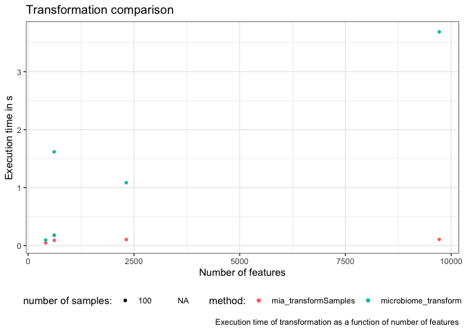

    ggplot(df, aes(x = Features, y = Transform, color = TransformCommand, shape = as.factor(Samples))) +
      geom_point() +
      labs(title = "Transformation comparison",
           x = "Number of features",
           y = "Execution time in s",
           color = "method:", shape = "number of samples:",
           caption = "Execution time of transformation as a function of number of features") +
      theme(legend.position = "bottom")

